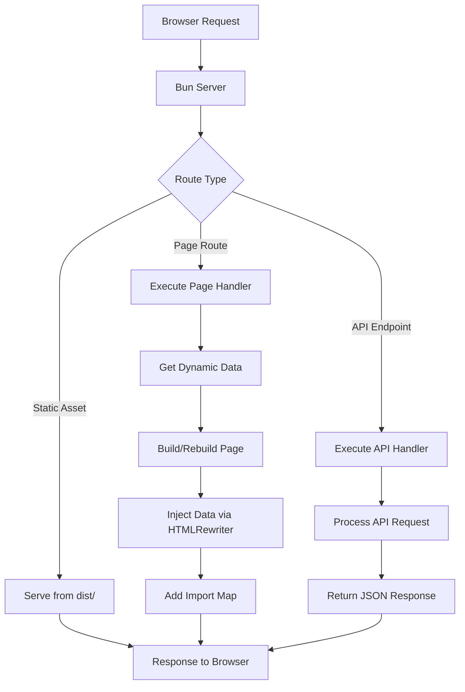

# @mements/serve

A lightweight, type-safe server framework for Bun with automatic performance tracking.

## Features

- **Type-Safe API Routes**: Build endpoints with complete type safety
- **Server-Side Data Injection**: Add dynamic data to your pages
- **Import Management**: Handle frontend dependencies automatically
- **Performance Tracking**: Built-in performance monitoring
- **Development Ready**: Fast hot reloading for quick iterations

## Installation

```bash
npm install @mements/serve
```

or 

```bash
yarn add @mements/serve
```

## Quick Start

Create a complete app with server-rendered pages and type-safe API:

```ts
import { serve } from "@mements/serve";

// Create a user dashboard application
serve({
  // Define pages with data handlers
  pages: [
    {
      route: '/dashboard',
      target: './pages/dashboard.tsx',
      handler: async (ctx) => {
        // Performance is automatically tracked
        const userId = ctx.query.userId || 'default';
        
        // Data from API gets injected into the page
        return {
          user: { name: 'Jane Doe', role: 'Admin' },
          stats: { visitors: 1024, conversions: 89 },
          lastLogin: new Date().toISOString()
        };
      },
    },
  ],
  
  // Type-safe API endpoints
  api: {
    '/api/users': async (req) => {
      const users = [
        { id: 1, name: 'Jane Doe', role: 'Admin' },
        { id: 2, name: 'John Smith', role: 'Editor' }
      ];
      
      return new Response(JSON.stringify(users), {
        headers: { "Content-Type": "application/json" },
      });
    },
    
    '/api/stats': async (req) => {
      const url = new URL(req.url);
      const period = url.searchParams.get('period') || 'week';
      
      const stats = { period, visitors: 1024, conversions: 89 };
      
      return new Response(JSON.stringify(stats), {
        headers: { "Content-Type": "application/json" },
      });
    }
  },
  
  // Frontend dependencies automatically managed
  imports: [
    { name: 'react', version: '18.2.0' },
    { name: 'react-dom/client', version: '18.2.0' },
    { name: '@chakra-ui/react', version: '2.5.1', deps: ['react'] },
    { name: 'recharts', version: '2.4.3', deps: ['react'] }
  ],
});
```

## Core Concepts

### Server-Side Data Injection

Your pages automatically receive data from server handlers:

```ts
// Server-side: pages/dashboard.tsx handler
{
  route: '/dashboard',
  target: './pages/dashboard.tsx',
  handler: async (ctx) => {
    // Get user data from database based on query params
    const userId = ctx.query.userId;
    return {
      user: await getUserById(userId),
      permissions: await getPermissions(userId),
      lastLogin: await getLastLogin(userId)
    };
  }
}

// Client-side: access data in your React component
function Dashboard() {
  // Data is automatically injected by the framework
  const { user, permissions, lastLogin } = window.serverData;
  
  return (
    <div>
      <h1>Welcome back, {user.name}</h1>
      <p>Last login: {new Date(lastLogin).toLocaleString()}</p>
      <PermissionsList permissions={permissions} />
    </div>
  );
}
```

### Type-Safe API Routes

Define fully typed API endpoints for frontend consumption:

```ts
// api-types.ts - shared between frontend and backend
export type GetStatsEndpoint = {
  method: 'GET';
  path: '/api/stats';
  query: { 
    period: 'day' | 'week' | 'month'; 
    userId?: string;
  };
  response: { 
    visitors: number;
    pageViews: number;
    conversions: number;
    conversionRate: number;
  };
};

// Frontend: generate type-safe fetch functions
async function fetchStats(
  period: GetStatsEndpoint['query']['period'], 
  userId?: string
): Promise<GetStatsEndpoint['response']> {
  const params = new URLSearchParams({ period });
  if (userId) params.append('userId', userId);
  
  const res = await fetch(`/api/stats?${params}`);
  return await res.json();
}

// Backend: implement with full type checking
const api = {
  '/api/stats': async (req) => {
    const url = new URL(req.url);
    const period = url.searchParams.get('period') as GetStatsEndpoint['query']['period'];
    const userId = url.searchParams.get('userId') || undefined;
    
    const stats = await getStats(period, userId);
    
    return new Response(JSON.stringify(stats), {
      headers: { "Content-Type": "application/json" },
    });
  }
};
```

### Import Management

Never worry about managing frontend dependencies - just declare what you need:

```ts
serve({
  // All dependencies are automatically resolved via ESM.sh
  imports: [
    // Core libraries
    { name: 'react', version: '18.2.0' },
    { name: 'react-dom/client', version: '18.2.0' },
    
    // UI components with dependencies
    { name: '@mui/material', version: '5.11.0', deps: ['react'] },
    { name: '@tanstack/react-query', version: '4.20.4', deps: ['react'] },
    
    // Individual modules
    { name: 'lodash/debounce' },
    { name: 'date-fns/format' }
  ],
});
```

The framework automatically:
1. Creates an import map for your frontend code
2. Resolves all dependencies through ESM.sh
3. Injects it into your HTML
4. Supports development mode with proper sourcemaps

## Handler Context

Page handlers receive a rich context with everything you need:

```ts
async function dashboardHandler(ctx) {
  // Access request data
  const { userId } = ctx.query;
  const { token } = ctx.headers;
  
  if (ctx.method === 'POST') {
    // Handle form submissions with parsed body
    await processFormData(ctx.body);
  }
  
  // Return JSON responses directly
  if (ctx.path.endsWith('/api')) {
    return ctx.json({ success: true });
  }
  
  // Add response headers
  ctx.setHeader('Cache-Control', 'max-age=3600');
  
  // Return data to inject into the page
  return {
    user: await getUserData(userId),
    isAdmin: await checkPermissions(userId, 'admin')
  };
}
```

## How It Works



## Development Features

- **Hot Reloading**: Pages rebuild on each request in development mode
- **Performance Monitoring**: Every operation is automatically timed
- **Request IDs**: Trace requests through your logs with unique IDs
- **Type Safety**: Full TypeScript support throughout your codebase

## License

MIT