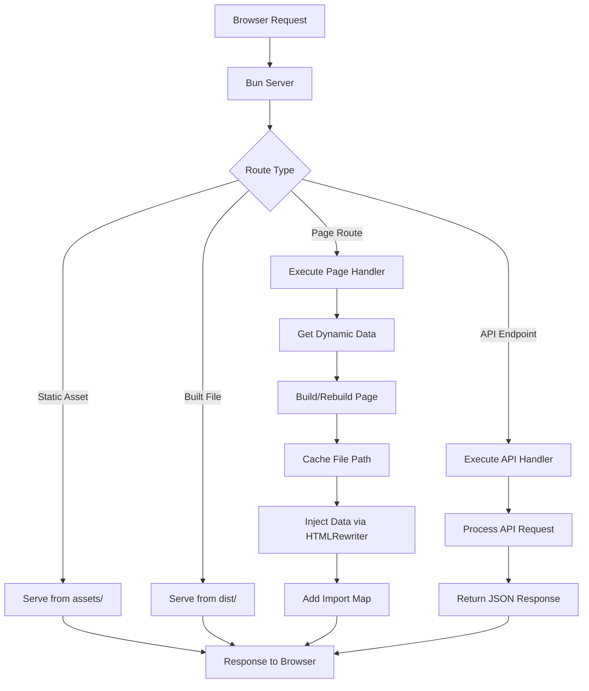

# @mements/serve

A lightweight, type-safe server framework for Bun with automatic performance tracking.

## Features

- **Type-Safe API Routes**: Build endpoints with complete type safety
- **API Endpoint Typing**: Define and enforce request/response contracts
- **Server-Side Data Injection**: Add dynamic data to your pages
- **Import Management**: Handle frontend dependencies automatically
- **Performance Tracking**: Built-in nested performance monitoring with request IDs
- **Development Ready**: Fast hot reloading for quick iterations
- **Static Assets**: Serve static files from a dedicated assets directory
- **Dependency Analysis**: Automatic package.json parsing and import generation

## Installation

```bash
npm install @mements/serve
```

or 

```bash
yarn add @mements/serve
```

## Quick Start

Create a complete app with server-rendered pages and type-safe API:

```ts
import { serve } from "@mements/serve";

// Create a user dashboard application
serve({
  // Define pages with data handlers
  pages: [
    {
      route: '/dashboard',
      target: './pages/dashboard.tsx',
      handler: async (ctx) => {
        // Performance is automatically tracked
        const userId = ctx.query.userId || 'default';
        
        // Data from API gets injected into the page
        return {
          user: { name: 'Jane Doe', role: 'Admin' },
          stats: { visitors: 1024, conversions: 89 },
          lastLogin: new Date().toISOString()
        };
      },
    },
  ],
  
  // Type-safe API endpoints
  api: {
    '/api/users': async (req) => {
      const users = [
        { id: 1, name: 'Jane Doe', role: 'Admin' },
        { id: 2, name: 'John Smith', role: 'Editor' }
      ];
      
      return new Response(JSON.stringify(users), {
        headers: { "Content-Type": "application/json" },
      });
    },
    
    '/api/stats': async (req) => {
      const url = new URL(req.url);
      const period = url.searchParams.get('period') || 'week';
      
      const stats = { period, visitors: 1024, conversions: 89 };
      
      return new Response(JSON.stringify(stats), {
        headers: { "Content-Type": "application/json" },
      });
    }
  },
  
  // Frontend dependencies automatically managed
  imports: [
    { name: 'react', version: '18.2.0' },
    { name: 'react-dom/client', version: '18.2.0' },
    { name: '@chakra-ui/react', version: '2.5.1', deps: ['react'] },
    { name: 'recharts', version: '2.4.3', deps: ['react'] }
  ],
});
```

## Core Concepts

### Type-Safe API Endpoints

Define concrete API endpoint types with strict typing:

```ts
// Define API endpoint types
export type ApiEndpoint = {
    method: 'GET' | 'POST' | 'PUT' | 'DELETE' | 'PATCH';
    path: string;
    body?: any;
    query?: Record<string, string | number | boolean>;
    response: any;
};

// Create specific endpoints
export type GetHealthEndpoint = {
    method: 'GET';
    path: '/api/health';
    query?: undefined;
    response: { status: string };
};

// Server implementation with full type-checking
const api = {
  '/api/health': async (req: Request): Promise<Response> => {
    return new Response(JSON.stringify({ status: 'ok' }), {
      headers: { "Content-Type": "application/json" },
    });
  }
};
```

### Server-Side Data Injection

Your pages automatically receive data from server handlers:

```ts
// Server-side: pages/dashboard.tsx handler
{
  route: '/dashboard',
  target: './pages/dashboard.tsx',
  handler: async (ctx) => {
    // Get user data from database based on query params
    const userId = ctx.query.userId;
    return {
      user: await getUserById(userId),
      permissions: await getPermissions(userId),
      lastLogin: await getLastLogin(userId)
    };
  }
}

// Client-side: access data in your React component
function Dashboard() {
  // Data is automatically injected by the framework
  const { user, permissions, lastLogin } = window.serverData;
  
  return (
    <div>
      <h1>Welcome back, {user.name}</h1>
      <p>Last login: {new Date(lastLogin).toLocaleString()}</p>
      <PermissionsList permissions={permissions} />
    </div>
  );
}
```

### Performance Tracking

Every operation is automatically timed and logged with unique request IDs and visual indicators:

```ts
// Nested performance tracking included automatically
const result = await measure(
  async (measure) => {
    // Run some expensive operation
    const data = await fetchData();
    
    // Measure nested operations with context
    return await measure(
      async () => processData(data),
      "Process fetched data" 
    );
  },
  "Fetch and process data",
  { requestId }
);

// Console output:
// [abc123] >$ Fetch and process data...
// [abc123] >>$ Process fetched data...
// [abc123] <<$ Process fetched data ✓ 45.32ms
// [abc123] <$ Fetch and process data ✓ 134.56ms
```

The framework automatically:
1. Generates unique request IDs
2. Tracks nested operations with visual indicators for start/end
3. Measures and logs execution time with success/failure states
4. Maintains context across async operations

### Import Management

Never worry about managing frontend dependencies - just declare what you need or let the framework analyze your package.json:

```ts
// Manual imports definition
serve({
  imports: [
    { name: 'react', version: '18.2.0' },
    { name: 'react-dom/client', version: '18.2.0' },
    { name: '@mui/material', version: '5.11.0', deps: ['react'] },
  ],
});

// Or use automatic package.json analysis
import { serve, generateImports } from "@mements/serve";
import packageJson from "./package.json";

serve({
  // Automatically analyze dependencies
  imports: generateImports(packageJson),
  // ...rest of config
});
```

The framework automatically:
1. Creates an import map for your frontend code
2. Resolves all dependencies through ESM.sh
3. Injects it into your HTML
4. Supports development mode with proper sourcemaps
5. Handles special cases like React JSX runtime

## Static Assets

Place your static files in the `./assets` directory and they'll be served automatically:

```
myapp/
├── assets/           # Static assets served directly
│   ├── favicon.ico
│   ├── images/
│   ├── fonts/
│   └── ...
├── pages/            # Dynamic pages with server handlers
├── dist/             # Build output (created automatically)
└── ...
```

## Handler Context

Page handlers receive a rich context with everything you need:

```ts
async function dashboardHandler(ctx) {
  // Access request data
  const { userId } = ctx.query;
  const { token } = ctx.headers;
  
  // Unique request ID for tracing
  console.log(`Request ID: ${ctx.requestId}`);
  
  // Performance tracking
  const userData = await ctx.measure(
    async () => fetchUserData(userId),
    "Fetch user data"
  );
  
  if (ctx.method === 'POST') {
    // Handle form submissions with parsed body
    await processFormData(ctx.body);
  }
  
  // Return JSON responses directly
  if (ctx.path.endsWith('/api')) {
    return ctx.json({ success: true });
  }
  
  // Add response headers
  ctx.setHeader('Cache-Control', 'max-age=3600');
  
  // Return data to inject into the page
  return {
    user: userData,
    isAdmin: await checkPermissions(userId, 'admin')
  };
}
```

## How It Works



## Development Features

- **Hot Reloading**: Pages rebuild on each request in development mode
- **Request Tracing**: Unique IDs for tracking requests through logs
- **Visual Performance Monitoring**: Operations tracked with visual indicators
- **File Path Caching**: Improved performance for built files
- **Static Assets Support**: Dedicated directory for static files
- **Package Analysis**: Automatic import generation from package.json
- **Error Handling**: Detailed stack traces during development
- **Type Safety**: Full TypeScript support throughout your codebase

## License

MIT